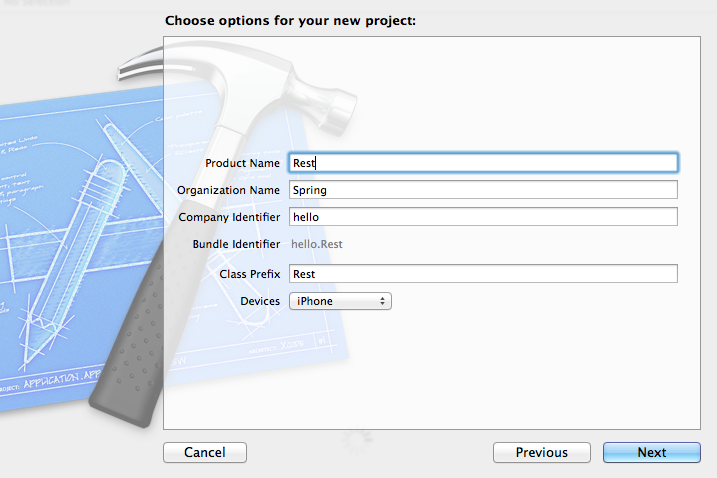

<#assign project_id="gs-consuming-rest-ios">
This guide walks you through writing a simple iOS client that consumes a Spring MVC-based [RESTful web service][u-rest].


What you will build
-------------------

You will build an iOS client that consumes a Spring-based RESTful web service.
Specifically, the client will consume the service created in [Building a RESTful Web Servce][gs-rest-service].

The iOS client will be accessed through the iOS Simulator, and will consume the service accepting requests at:

    http://rest-service.guides.spring.io/greeting

The service will respond with a [JSON][u-json] representation of a greeting:

```json
{"id":1,"content":"Hello, World!"}
```

The iOS client will render the ID and content into the DOM.


What you will need
------------------

 - About 15 minutes
 - A Mac running OS X
 - Xcode
 - An internet connection


Create an iOS Project
---------------------

Within Xcode, create a new project, using the "Single View Application" template. If you prefer, you can use the project in the `initial` folder and skip ahead to [Create a ViewController](#initial) 


Choose the following options for the new project. These are the values used in the sample code. However, you are not publishing this app to the Apple App Store, so you can choose whatever you like.




<a name="initial"></a>
Create a ViewController
-----------------------

The Model-View-Controller design pattern (MVC) is used extensively in iOS applications. As the name implies, a ViewController controls the view. When you created the project, a `RestViewController` was also created with an empty implementation. 

First, modify the header file to include two properties, and a method signature.

    <@snippet path="Rest/RestViewController.h" prefix="complete"/>
    
The `greetingId` and `greetingContent` properties are `UILabel` types. These properties are declared with the type qualifier of `IBOutlet`. By declaring these as an `IBOutlet`, they can easily be connected to the view. Note how the `fetchGreeting` method is also declared with a type qualifier, in this case `IBAction`. Like the properties, this allows the method to be connected to a control in the view, for example a button.

Now update the `fetchGreeting` method body in the main class file. 

    <@snippet path="Rest/RestViewController.m" prefix="complete"/>

There are two methods in the main class file, `fetchGreeting` and `viewDidLoad`. `RestViewController` inherits from `UIViewController`, and `viewDidLoad` overrides the default implementation so that `fetchGreeting` is called when the view is first loaded.

The `fetchGreeting` method is where the REST request happens. It uses `NSURLConnection` to send an asynchronous request to the specified URL. This particular method makes use of an Ojective-C construct called a "block". Blocks are similar to closures or lambdas in other programming languages. In this case, the block is passed to the `completionHandler` method parameter, meaning that on completion the code within the block will be executed.

If data was received and there wasn't an error when the HTTP request completes, `NSJSONSerialization` is used to read the data into an `NSDictionary`. Once the data is available in a dictionary, the "id" and "content" values can be retrieved and assigned to the two labels that were defined in the header.


Create the View
---------------

TODO


<a name="test"></a>
Test the client
---------------

You can now open the app in the iOS simulator, where you see:


The ID value will increment each time you click the refresh button.


Summary
-------

Congratulations! You've just developed an jQuery client that consumes a Spring-based RESTful web service.

[gs-rest-service]: /guides/gs-rest-service/
[zip]: https://github.com/spring-guides/${project_id}/archive/master.zip
<@u_rest/>
<@u_json/>
<@u_git/>

